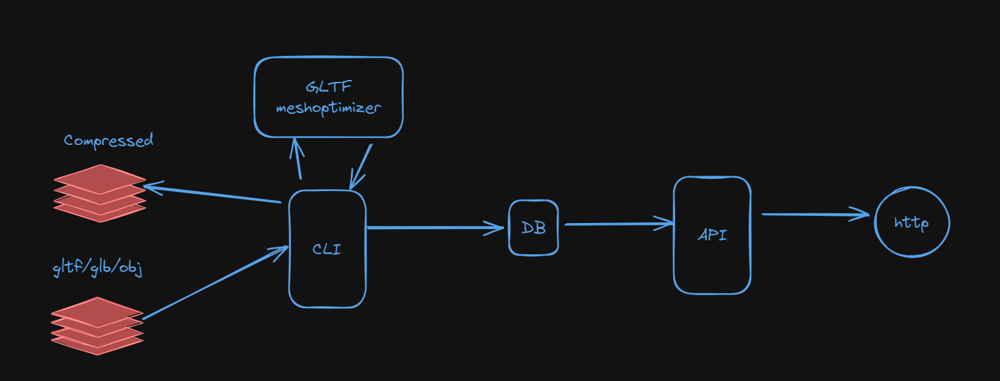

# ModelMan
### 3D Asset Processor App
This repository contains two Python applications:

1. CLI App
2. REST API with Flask

## Architecture


## CLI App (Task 1)

### Requirements
- Python 3.x
- Watchdog library: `pip install watchdog`
- SQLite
- Gltf Mesh Optimizer [Download Link](https://github.com/zeux/meshoptimizer/releases). Copy the executable in this project directory manually

### How to Run
1. Clone this repository.
2. Install the required dependencies: `pip install -r requirements.txt`
3. Run the CLI app: `python cli_app.py`
4. Enter the folder path when prompted.
5. The app will continuously monitor the specified folder for .gltf, .glb, or .zip files, extract and compress the relevant files, and store information in the SQLite database.

## REST API (Task 2)

### Requirements
- Python 3.x
- Flask library: `pip install flask`

### How to Run
1. Ensure the CLI App is running and processing files.
2. Install the required dependencies: `pip install -r requirements.txt`
3. Run the Flask app: `python rest_api.py`

## Docker

### Build Docker Image
```bash
docker build -t file-processing-app .
```

### Run Docker Container
```bash
docker run -p 5000:5000  -v /path/to/folder:/app/folder file-processing-app
```
Replace /path/to/folder with the absolute path of the folder to be monitored.
Now, you can access the REST API at http://localhost:5000.


### API Endpoints
#### Get All Files
- Endpoint: ```/files```
- Method: GET
- Returns a JSON response with information about all files in the database.

#### Get File Info by Filename
- Endpoint: ```/file/<filename>```
- Method: GET
- Returns a JSON response with the file path and name for the specified filename.


### Testing locally

#### Run CLI App tests
```
python test_cli_app.py
```

#### Run Flask API tests
```
python test_api_app.py
```


Please note that this code assumes the presence of a `file_info.db` SQLite database in the same directory. The database will be created automatically by the CLI app when it starts. Additionally, make sure to install the required Python packages by running `pip install -r requirements.txt`.